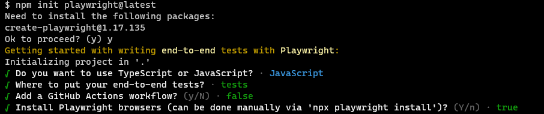
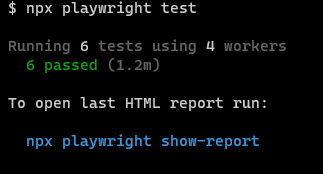
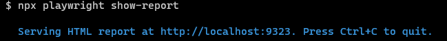
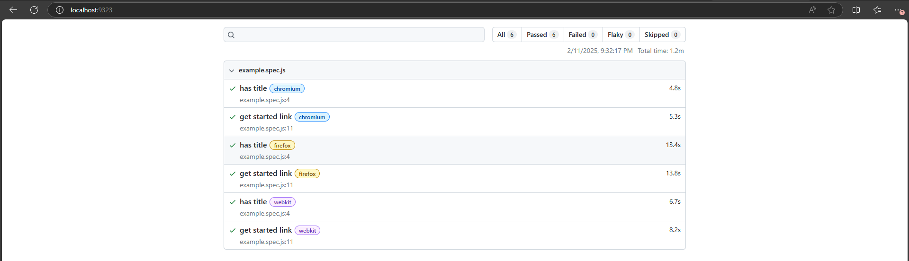
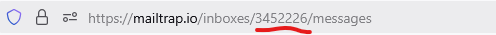
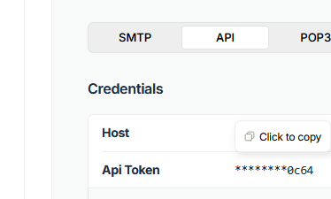

## Forking the Repository

    Fork the original repository: https://github.com/ComunidadeTechQA/qatw-primeira-edicao

## After cloning it in your local machine, enter in the directory and create a new Playwright project

    npm init playwright@latest

## Running the initial tests (by default they run in three different browsers - Chrome, Firefox and Safari)

    npx playwright test

## Showing the native report on the browser

    npx playwright show-report

## Manually testing the login

- Having you mailtrap account created, access your inbox at `https://mailtrap.io/inboxes` and get your inbox id to be used in this project and update the values below in the `playwright.config.js` file:
    MAILTRAP_ACCOUNT_ID
    MAILTRAP_INBOX_ID

- Also get you API token and update it in the `MAILTRAP_TOKEN` value in the `playwright.config.js` file:

## Creating login test case using Playwright Codegen

    npx playwright codegen http://paybank-mf-auth:3000